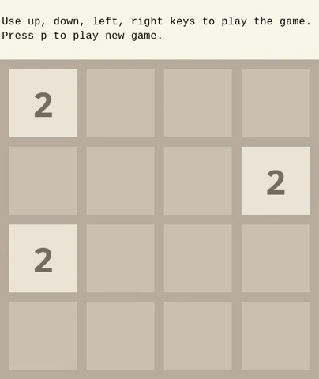

# 2048

Java clone of popular game 2048.

## Execution

Project was created and developed on OOP classes, third semester of computer science studies at 
AGH University of Science and Technology.

## Example of running

## Built With

* Java 8
* Swing - to create simple GUI

## Authors

* **Wiktor Tarsa** - AGH University of Science and Technology.

Kraków, January 2020
